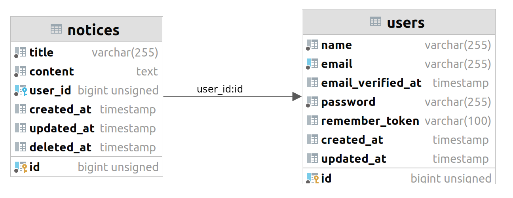

# Notice Test Project
This is a test project for php interview.

## Database
The structure is like below.


## Setup
### Docker
reference: https://www.digitalocean.com/community/tutorials/how-to-install-and-set-up-laravel-with-docker-compose-on-ubuntu-22-04 
```shell
docker compose up -d
```

Then you need to run the migrations and seeds for first install 
```shell
docker compose exec app composer install
docker compose exec app php /var/www/artisan key:generate
docker compose exec app php /var/www/artisan storage:link
docker compose exec app php /var/www/artisan migrate
docker compose exec app php /var/www/artisan db:seed
```

To run test run
```shell
docker compose exec app vendor/bin/phpunit
```

### Local

For running without docker first install the dependencies using `composer install`.
Then run the migration and seeds.
```shell
php artisan key:generate
php artisan storage:link
php artisan migrate
php artisan db:seed
```
Then server the app
```shell
php artisan serve
```

To run test run
```shell
vendor/bin/phpunit
```
